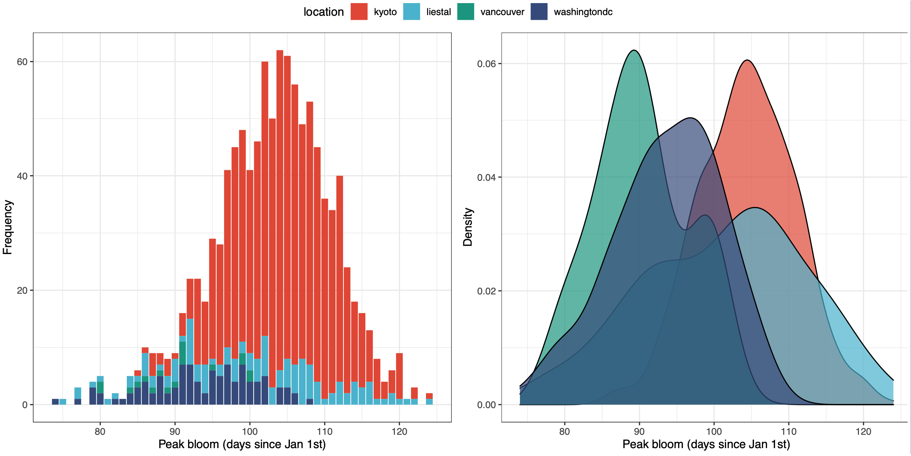
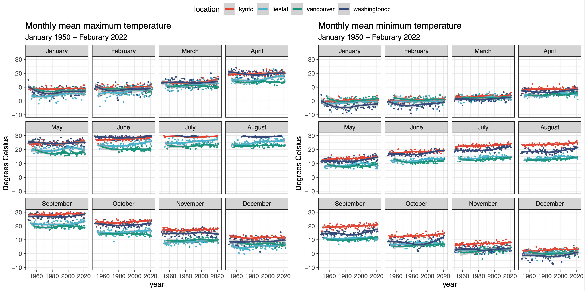
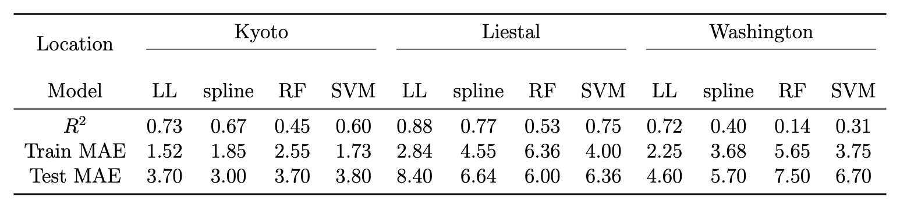
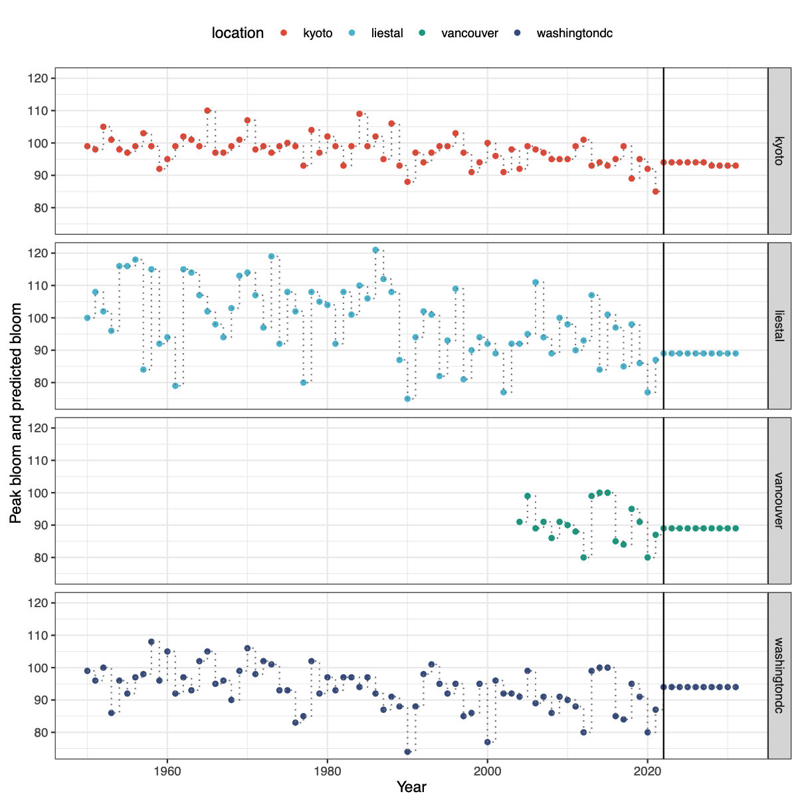

  

# Cherry blossom peak bloom prediction

A submission for 2022 [George Mason’s Department of Statistics cherry blossom peak bloom prediction competition](https://competition.statistics.gmu.edu/). We won the Award for Best Narrative (Statistics).

### Authors

- [@MiaoshiqiLiu](https://github.com/MiaoshiqiLiu)
- [@siyueyang](https://github.com/siyueyang)

## Cherry blossom prediction competition

The first cherry bloom competition focuses on the predictions for Washington, D.C. (USA), Kyoto (Japan), Liestal-Weideli (Switzerland) and Vancouver, BC (Canada).  

#### Competition data

The competition provides cleaned data in the [Github repo](https://github.com/GMU-CherryBlossomCompetition/peak-bloom-prediction), containing 

- **peak bloom dates** across three international locations: Kyoto, Liestal, and Washington D.C., while the bloom dates are _missing_ for Vancouver. 

- **peak bloom dates** for various sites across Switzerland, Japan, South Korea, and the USA. 

- **global meteorological data** from the Global Historical Climatology Network (GHCN) in the `rnoaa` package with illustration in the initial analysis. 

## Our attempts

#### 1. Data preparation

We extracted Vancouver bloom peak dates during 2004-2021 from the National Park Website. 
Below shows the distribution of the peak bloom dates.

Peak bloom days in Kyoto are more
concentrated, while the days in other three locations are more spread out. Cherry blossom
is earlier in Vancouver and Washington DC than Kyoto and Liestal; this may due to the
differences in the locations and climate features.

We extracted weather data from `rnoaa` package. As weather data is missing across several years, we used the Kalman Smoothing time series model to impute the daily temperature. 

Here is the monthly average maximum and minimum temperature across four sites. Due to the different temperature trends, _seperate models_ or _hierarchical models_ should be considered for forecasting the bloom dates. We used separate models in our analysis. 

Additionally, we summarized daily weather data into 

- accumulated growing degree days (AGDD)
- first growing days of year (FGDDY)
- last growing days of year (LGDDY) 
- accumulated freezing degree days (AFDD)
- first freezing days of year (AFDDY)
- last freezing days of year (LFDDY)
- average maximum temperature in Winter (Tmax-W)
- average maximum temperature in Spring (Tmax-S)
- average minimum temperature in Winter (Tmin-W)
- average minimum temperature in Spring (Tmin-S)
- average precipitation in Winter (PRCPW)
- average precipitation in Spring (PRCP-S)

#### 2. Model training for Kyoto, Liestal, Washington

We split the data into the validation set (10 years) and training set (otherwise) and considered the following model:

- Varying-coefficient regression model with local linear estimation (LL)
- Generalized addictive model with spline estimation (spline)
- Random forest (RF)
- Support vector machine (SVM)

The nonparametric models (LL and spline) generally _outperform_ machine learning methods (RF and SVM) with higher R square and better interpretability. 

Considering that the spline method expresses the coefficients as a linear combination of the
spline basis, we finally chose **spline method** as the estimation technique in that it facilitates
the prediction process by directly giving us the exact form of the coefficient functions.

#### 3. Model training for Vancouver

The fully labeled training set only has 17 years of data for Vancouver (2004-2021). Due to the limited sample size and the relatively large number of covariates, training a common statistical or machine learning model with such
dataset might result in overfitting, further leading to low out-of-sample accuracy.  Therefore,
we are considering using the **semi-supervised learning** techniques to train models on both
labeled and unlabeled data. When the weather information contained in the unlabeled data
is related to the bloom days, the model estimation efficiency will be improved. In practice,
this means we need fewer samples to get a desired estimating standard error.

#### 4. Prediction of the covariates and response

As the weather data is not available for the next 10 years, we use ARIMA to predict the weather (covariates) first and fitted bloom date prediction model using the predicted covariates.

#### 5. Results

Below is the peak bloom dates of the four sites, with the predicted ones (2022-2031) presented after the vertical line.  

Despite the inevitable limitations due to the intrinsic complexity of the phenological
event, the models selected could be improved by increasing the sample size and polishing
the prediction of the temperature for the next 10 years. It would also be of interest to
incorporate more climate information so as to investigate the possible interplay between the
cherry blossom and global warming.

## Links

- [Our code and analysis](https://github.com/siyueyang/peak-bloom-prediction/blob/main/final_analysis.Rmd) for reproducibility 
- [Our narrative report](https://github.com/siyueyang/peak-bloom-prediction/blob/main/Cherry_Blossom_Prediction.pdf)

## Contacts

Should you have any questions, comments regarding the submission, please feel free to email us.  We are happy to discuss and answer questions. 

- syue.yang@mail.utoronto.ca