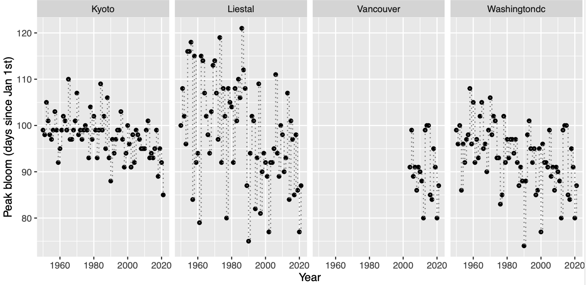

  

# Cherry blossom peak bloom prediction

A submission for 2022 [George Mason’s Department of Statistics cherry blossom peak bloom prediction competition](https://competition.statistics.gmu.edu/). We won the Award for Best Narrative (Statistics).

### Authors

- [@MiaoshiqiLiu](https://github.com/MiaoshiqiLiu)
- [@siyueyang](https://github.com/siyueyang)

## Cherry blossom prediction competition

The first cherry bloom competition focuses on the predictions for Washington, D.C. (USA), Kyoto (Japan), Liestal-Weideli (Switzerland) and Vancouver, BC (Canada).  

#### Competition data

The competition provides cleaned data in the [Github repo](https://github.com/GMU-CherryBlossomCompetition/peak-bloom-prediction), containing 

- **peak bloom dates** across three international locations: Kyoto, Liestal, and Washington D.C., while the bloom dates are _missing_ for Vancouver. 

- **peak bloom dates** for various sites across Switzerland, Japan, Sourth Korea, and the USA. 

- **global meteorological data** from the Global Historical Climatology Network (GHCN) in the `rnoaa` package with illustration in the initial analysis. 

## Our attempts

#### Data preparation

We extracted Vancouver bloom peak dates during 2004-2021 from the National Park Website. 
Below shows the distribution of the peak bloom dates.

We noticed that weather data is missing
across several years, thus using the Kalman Smoothing time series model to impute the
daily temperature. 
